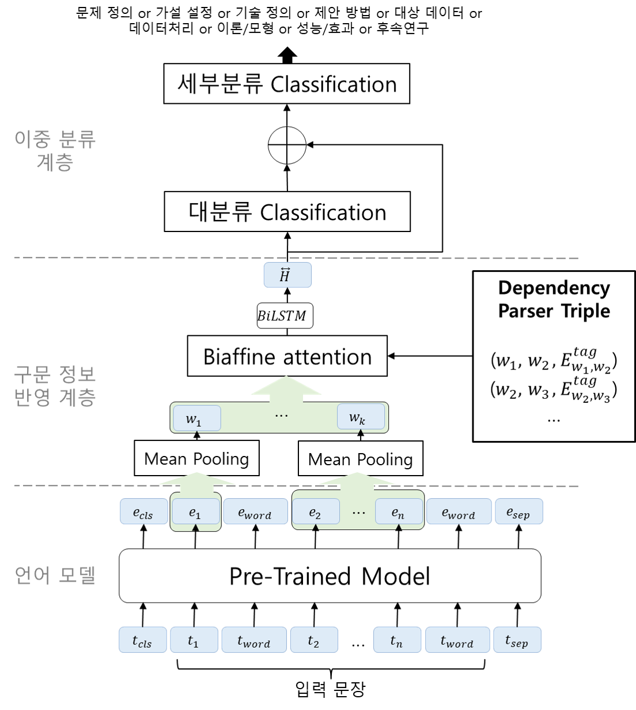

# Dual-Classification of Scientific Paper Sentence
Code for KCC 2022 paper: *[Dual-Classification of Paper Sentence using Chunk Representation Method and Dependency Parsing](https://www.dbpia.co.kr/journal/articleDetail?nodeId=NODE11113336)*


## Setting up the code environment

```
$ virtualenv --python=python3.6 venv
$ source venv/bin/activate
$ pip install -r requirements.txt
```

All code only supports running on Linux.

## Model Structure




## Data

*[국내 논문 문장 의미 태깅 데이터셋](https://aida.kisti.re.kr/data/8d0fd6f4-4bf9-47ae-bd71-7d41f01ad9a6)*

### Directory and Pre-processing
`의존 구문 분석 모델은 미공개(The dependency parser model is unpublished)`
```
├── data
│   ├── origin.json
│   └── origin
│       ├──DP_origin_preprocess.json
│       └── merge_origin_preprocess
│           ├── origin_train.json
│           └── origin_test.json
├── bert
│   ├── init_weight
│   └── biaffine_model
│       └── multi
├── src
│   ├── dependency
│       └── merge.py
│   ├── functions
│       ├── biattention.py
│       ├── utils.py
│       ├── metric.py
│       └── processor.json
│   └── model
│       ├── main_functions_multi.py
│       └── model_multi.py
├── run_baseline_torch.py
├── requirements.txt
└── README.md
```

* 원시 데이터(data/origin.json)를 의존 구문 분석 모델을 활용하여 입력 문장 쌍에 대한 어절 단위 의존 구문 구조 추출(data/origin/DP_origin_preprocess.json)

* 입력 문장 쌍에 대한 어절 단위 의존 구문 구조(data/origin/DP_origin_preprocess.json)를 src/dependency/merge.py를 통해 입력 문장 쌍에 대한 청크 단위 의존 구문 구조로 변환(data/origin/merge_origin_preprocess/origin.json)

* 학습 데이터와 평가 데이터를 세부분류별 4:1 비율로 나누기(data/origin/merge_origin_preprocess/origin_train.json, (data/origin/merge_origin_preprocess/origin_test.json))

* [bert/init_weight](https://huggingface.co/klue/bert-base)의 vocab.json에 청크 단위로 구분해주는 스폐셜 토큰(Special Token) `<WORD>` 추가

## Train & Test

* KLUE/BERT-base: `python run_baseline_torch.py`

## Results 

| Model | Macro F1 | Acc |
|---|--------- |--------- |
| BERT | 89.66% | 89.90% |
| proposed | 89.75% | 89.99% |
